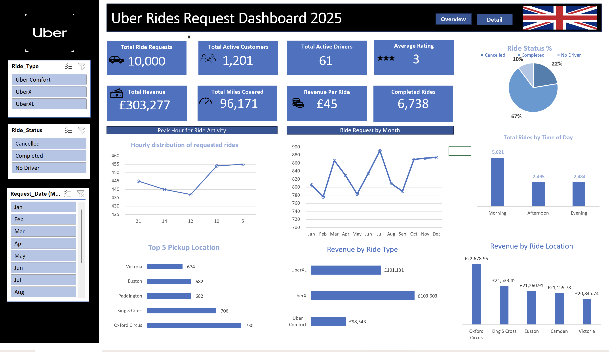
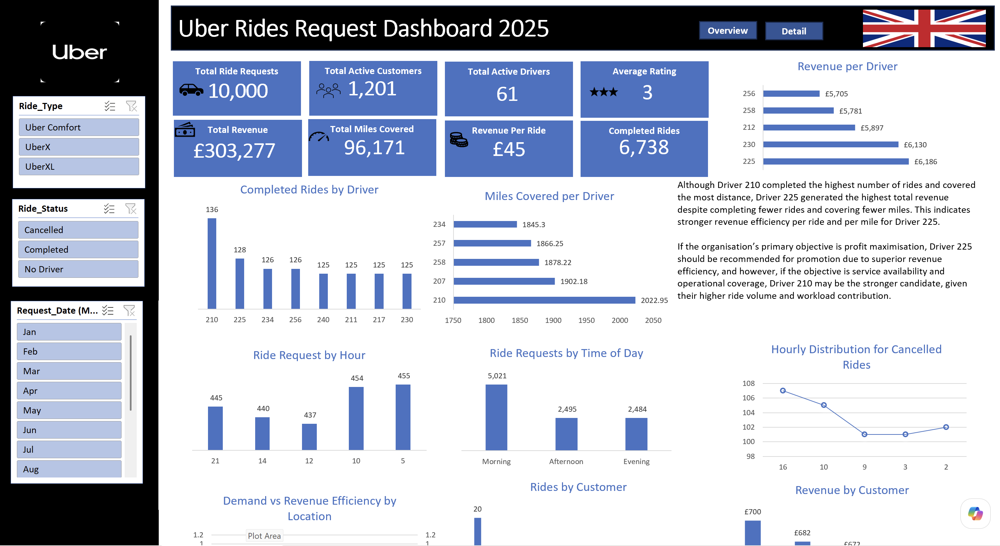

# 🚗 Uber Rides Request Analysis

Excel Dashboard Project | 10,000 Ride Requests | London, United Kingdom | 2025

## 📚 Table of Contents
- [Project Overview](#project-overview)
- [Tools & Technologies](#tools--technologies)
- [Dataset Breakdown](#dataset-breakdown)
- [Dashboard Walkthrough](#dashboard-walkthrough)
- [Key Insights & Findings](#key-insights--findings)
- [Recommendations](#recommendations)

---

## Project Overview

This self-initiated project analyses 10,000 Uber ride requests across London 
to monitor operational performance, driver efficiency and customer demand 
patterns. Built entirely in Excel, the interactive two-page dashboard covers 
key metrics including total revenue, completed rides, driver performance, 
peak demand hours, top pickup locations and ride status breakdown.

The goal was to turn raw ride request data into clear, actionable insights 
that support both operational and strategic decisions — from driver promotion 
criteria to demand planning and cancellation reduction.

---

## Tools & Technologies

- Microsoft Excel — primary analysis and dashboard tool
- Pivot Tables — data aggregation and summarisation
- Pivot Charts — interactive visualisations
- Slicers — dynamic filtering by ride type, status and month
- Dashboard Design — two-page interactive report layout

---

## Dataset Breakdown

- 10,000 ride requests across London
- Revenue data — total, per ride, per driver
- Driver metrics — completed rides, miles covered, revenue generated
- Customer data — active customers, rides per customer
- Ride types — Uber Comfort, UberX, UberXL
- Ride status — Completed, Cancelled, No Driver
- Pickup locations — top 5 London locations
- Time data — hourly distribution, time of day, monthly trends

---

## Dashboard Walkthrough

### Page 1 — Overview

The first page provides a high-level operational summary. Key metrics 
include 10,000 total ride requests, 1,201 active customers, 61 active 
drivers, average rating of 3, £303,277 total revenue, 96,171 total miles 
covered, £45 revenue per ride and 6,738 completed rides.

The ride status pie chart shows 67% of rides completed, 22% with no 
driver available and 10% cancelled — establishing a clear baseline for 
operational reliability. Supporting visuals include completed rides by 
driver, miles covered per driver, revenue per driver and ride requests 
by time of day.

---

### Page 2 — Detail

The second page drills into demand patterns and geographic performance. 
Key visuals include hourly distribution of ride requests, ride requests 
by month, top 5 pickup locations, revenue by ride type and revenue by 
ride location.

Morning demand dominates at 5,021 requests compared to 2,495 in the 
afternoon and 2,484 in the evening. Victoria is the top pickup location 
with 674 requests. UberXL generates the highest revenue at £101,131 
despite likely having fewer rides than UberX — indicating higher 
per-ride value.

---

## Key Insights & Findings

1. **Driver 225 outperforms on revenue efficiency** — although Driver 210 
completed the highest number of rides (136) and covered the most distance 
(2,022.95 miles), Driver 225 generated the highest total revenue (£6,186) 
despite completing fewer rides and covering fewer miles. This indicates 
stronger revenue efficiency per ride and per mile for Driver 225.

2. **22% of requests have no driver available** — this is the single 
largest operational issue, representing over 2,200 lost ride opportunities. 
Driver availability rather than cancellations is the primary cause of 
unmet demand.

3. **Morning is peak demand period** — with 5,021 morning requests against 
approximately 2,490 each for afternoon and evening, morning represents 
double the demand of any other time period. Driver allocation should 
reflect this imbalance.

4. **UberXL generates the highest revenue** — at £101,131 total, UberXL 
outperforms the other ride types in revenue despite likely lower volume, 
suggesting higher per-ride value and a premium customer segment worth 
growing.

5. **Victoria is the top pickup location** — with 674 requests, Victoria 
Station is the single highest demand pickup point, followed by other 
central London locations. Driver positioning strategy should prioritise 
this area during peak hours.

6. **Average rating of 3 out of 5 is concerning** — a midpoint rating 
across 10,000 rides suggests consistent service quality issues that 
require investigation beyond individual driver performance.

---

## Recommendations

1. **Use revenue efficiency as the primary driver promotion metric** — 
Driver 225's superior revenue per ride demonstrates that completed ride 
volume alone is a misleading performance indicator. Promotion criteria 
should weight revenue efficiency alongside volume.

2. **Address the no-driver availability problem urgently** — with 22% 
of requests unmet due to driver unavailability, increasing driver supply 
during peak periods represents the highest-impact revenue recovery 
opportunity.

3. **Concentrate driver deployment in the morning** — morning demand 
is double afternoon and evening combined. Incentivising drivers to be 
active during morning hours would directly reduce the no-driver 
cancellation rate.

4. **Prioritise Victoria and central London pickup zones** — positioning 
more drivers near Victoria Station and surrounding high-demand locations 
during peak hours would improve fulfilment rates and customer satisfaction.

5. **Investigate the rating issue** — a platform-wide average of 3 
suggests a systemic quality problem. A deeper analysis of low-rated 
rides by driver, location, time and ride type would identify the 
root cause.
